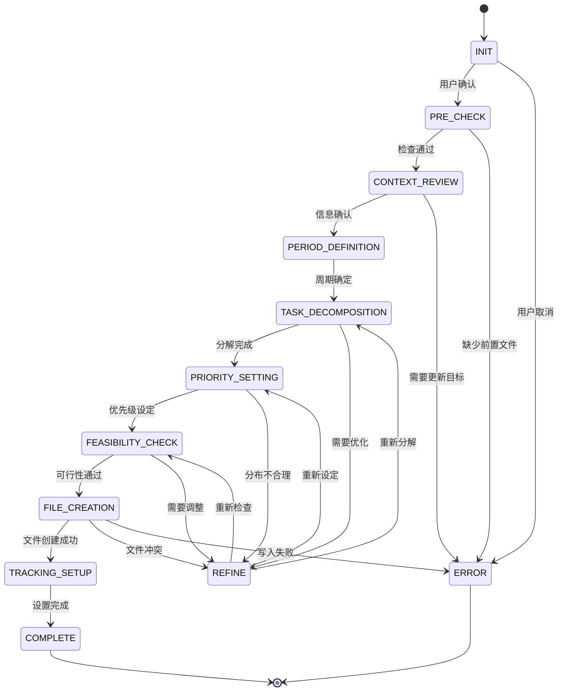

# 创建任务工作流 Create Task Workflow

<workflow_meta>
## 工作流元信息

- **前情提要**：你已经和用户创建了一个明确且可实现的目标以及对应的阶段里程碑，目标文件存储在`goals`目录下的相应文件夹内，包含`goal.md`和`milestones.md`文件。
- **工作流目标**：基于已有的内容，协助用户创建当前周期内要完成的小任务，确保任务具体且可操作（使用SMART原则）。
- **周期定义**：当前周期指下次进行目标评估或进度跟踪之前的时间段（以最近的时间点为准），一般在`goal.md`、`milestones.md`、`preferences.md`文件中会有相关的时间节点提示。
- **进度追踪**：在过程中使用TODO工具来追踪工作流步骤的交互式执行进度情况。
</workflow_meta>

<state_machine>
## 状态机工作流 State Machine Workflow

### 状态转换图 State Transition Diagram



### 状态定义与转换规则 State Definitions

#### STATE: INIT (初始化)
**进入条件**: 工作流启动
**执行动作**:
- 向用户说明工作流目标
- 确认用户准备好开始
**转换规则**:
```
IF 用户确认准备好 THEN
  → PRE_CHECK
ELSE IF 用户取消 THEN
  → ERROR (用户取消)
END IF
```

#### STATE: PRE_CHECK (前置条件检查)
**进入条件**: 从 INIT 转换而来
**执行动作**:
- 检查 `goals/` 目录是否存在
- 使用 CLI 工具扫描目标文件夹
- 使用 CLI 工具验证前置条件

**CLI 工具使用**:
```bash
# 检查 CLI 工具可用性
opco --version

# 获取所有活跃目标列表
opco list --active --json

# 如果找到多个目标，获取目标详情供用户选择
opco view <goal-name> --json

# 验证前置条件
opco validate <goal-name> --workflow create-task --json

# 如果 tasks.md 已存在，获取现有任务统计
opco tasks <goal-name> --json
```

**前置条件检查逻辑**:
```
IF CLI 工具不可用 THEN
  切换到手动模式检查目录和文件
ELSE
  使用 CLI 工具进行以下检查
END IF

IF goals/ 目录不存在 THEN
  "哎呀，看起来你还没有创建目标呢 (｡•́︿•̀｡)"
  "我们需要先创建一个目标，才能制定任务哦！"
  询问: "要不要现在开始创建目标？"
  IF 用户同意 THEN
    → ERROR (引导至 create-goal 工作流)
  ELSE
    → ERROR (缺少前置条件)
  END IF
END IF

# 使用 CLI 获取活跃目标列表
activeGoals = 执行 `opco list --active --json`

IF activeGoals.data.goals.length > 1 THEN
  展示所有活跃目标
  询问: "你想为哪个目标制定任务呢？"
  FOR EACH goal IN activeGoals.data.goals DO
    显示: "- ${goal.title} (${goal.name})"
  END FOR
  等待用户选择
  selectedGoal = 用户选择的目标
  使用 `opco view <selectedGoal> --json` 获取详细信息展示
ELSE IF activeGoals.data.goals.length == 1 THEN
  selectedGoal = activeGoals.data.goals[0].name
  "找到了你的目标：${activeGoals.data.goals[0].title}"
ELSE
  → ERROR (没有活跃目标)
END IF

# 验证前置条件
validationResult = 执行 `opco validate <selectedGoal> --workflow create-task --json`

IF NOT validationResult.data.isValid THEN
  IF validationResult.data.missingFiles.includes("goal.md") THEN
    → ERROR (目标文件缺失，引导至 create-goal)
  END IF
  
  IF validationResult.data.missingFiles.includes("milestones.md") THEN
    询问: "我没找到里程碑文件，要不要先补充一下里程碑？"
    IF 用户同意 THEN
      → ERROR (引导补充里程碑)
    ELSE
      "好的，那我们直接制定任务吧！"
      → CONTEXT_REVIEW
    END IF
  END IF
END IF

# 检查 tasks.md 是否已存在
try
  taskStats = 执行 `opco tasks <selectedGoal> --json`
  tasksExist = true
catch error
  tasksExist = false
END try

IF tasksExist THEN
  展示现有任务统计:
  - 总任务数: taskStats.stats.total
  - 已完成: taskStats.stats.completed
  - 未完成: taskStats.stats.pending
  - 完成率: ${taskStats.stats.percentage}%
  
  询问: "我看到你已经有任务清单了，是要：
  1. 创建新周期的任务（归档旧任务）
  2. 更新现有任务
  3. 查看现有任务"
  
  IF 用户选择 1 THEN
    询问: "要归档旧任务吗？"
    IF 用户同意 THEN
      执行 `opco archive <selectedGoal> --json`
      展示归档结果
    END IF
    → CONTEXT_REVIEW
  ELSE IF 用户选择 2 THEN
    "好的，我们来看看怎么更新现有任务~"
    → CONTEXT_REVIEW
  ELSE IF 用户选择 3 THEN
    执行 `opco tasks <selectedGoal> --show-tasks`
    展示任务列表
    询问: "看完后要继续吗？"
    IF 用户同意 THEN
      → CONTEXT_REVIEW
    ELSE
      → ERROR (用户取消)
    END IF
  END IF
END IF
```

**转换规则**:
```
IF 所有前置条件满足 THEN
  → CONTEXT_REVIEW
ELSE IF 缺少必要文件 THEN
  → ERROR (引导用户完成前置工作流)
END IF
```

#### STATE: CONTEXT_REVIEW (上下文回顾)
**进入条件**: 前置检查通过
**执行动作**: 使用 CLI 工具读取并回顾目标和里程碑

**CLI 工具使用**:
```bash
# 获取目标详情
opco view <goal-name> --json

# 获取现有任务统计（如果有）
opco tasks <goal-name> --json
```

**回顾策略**:
```
# 使用 CLI 工具获取目标信息
goalInfo = 执行 `opco view <goal-name> --json`

# 提取关键信息
goalTitle = goalInfo.data.metadata.title
goalDescription = goalInfo.data.metadata.description
goalStatus = goalInfo.data.metadata.status
goalDeadline = goalInfo.data.metadata.deadline
goalCreated = goalInfo.data.metadata.created

# 如果有现有任务，获取任务统计
try
  taskStats = 执行 `opco tasks <goal-name> --json`
  hasExistingTasks = true
catch error
  hasExistingTasks = false
END try

# 向用户呈现摘要
"让我们先回顾一下你的目标 📋

目标：${goalTitle}
状态：${goalStatus}
创建时间：${goalCreated}
${goalDeadline ? "截止日期：" + goalDeadline : ""}

${goalDescription ? "描述：" + goalDescription : ""}
"

# 如果有现有任务，显示当前进展
IF hasExistingTasks THEN
  "
当前进展：
- 总任务数：${taskStats.stats.total}
- 已完成：${taskStats.stats.completed}
- 未完成：${taskStats.stats.pending}
- 完成率：${taskStats.stats.percentage}%
"
END IF

# 读取 milestones.md 获取里程碑信息（手动读取或通过 CLI）
milestones = 读取 milestones.md

# 显示最近的2-3个里程碑
"
最近的里程碑：
- [里程碑1] - [时间]
- [里程碑2] - [时间]

现在我们来制定具体的行动任务吧！"
```

**转换规则**:
```
IF 用户确认信息正确 THEN
  → PERIOD_DEFINITION
ELSE IF 用户发现信息需要更新 THEN
  "好的，我们先更新一下目标信息吧"
  询问需要更新的字段
  IF 用户确认 THEN
    使用 `opco update <goal-name> --field <field> --value <value>` 更新
    展示更新结果
  END IF
  → CONTEXT_REVIEW (重新确认)
ELSE IF 用户想更新状态 THEN
  使用 `opco update <goal-name> --status <status>` 更新状态
  → CONTEXT_REVIEW (重新确认)
END IF
```

#### STATE: PERIOD_DEFINITION (周期定义)
**进入条件**: 上下文回顾完成
**执行动作**: 与用户确认当前任务周期

**CLI 工具使用**:
```bash
# 获取当前日期
opco date

# 计算周期结束日期
opco date --offset +1w
opco date --offset +2w

# 计算下次评估时间
opco date --offset +3d
```

**周期定义策略**:
```
1. 获取当前日期
currentDate = 执行 `opco date`

2. 从文件中提取建议周期
IF preferences.md 中有周期偏好 THEN
  使用用户偏好的周期长度
ELSE IF milestones.md 中有最近的里程碑 THEN
  建议周期 = 到最近里程碑的时间
ELSE
  建议默认周期（如2周或1个月）
END IF

3. 与用户确认：展示当前日期并确认周期
"今天是 ${currentDate}"
Q: "这次任务清单的周期是多久呢？我建议是[建议周期]，你觉得呢？"

4. 周期识别和计算
IF 用户指定周期为"一周"或"1周" THEN
  periodEndDate = 执行 `opco date --offset +1w`
  展示: "周期从 ${currentDate} 到 ${periodEndDate}"
ELSE IF 用户指定周期为"两周"或"2周" THEN
  periodEndDate = 执行 `opco date --offset +2w`
  展示: "周期从 ${currentDate} 到 ${periodEndDate}"
ELSE IF 用户指定具体天数 THEN
  periodEndDate = 执行 `opco date --offset +${days}d`
  展示: "周期从 ${currentDate} 到 ${periodEndDate}"
ELSE IF 用户指定具体日期 THEN
  验证日期格式
  计算天数 = 执行 `opco date --diff ${specifiedDate}`
  展示: "周期从 ${currentDate} 到 ${specifiedDate}，共 ${calculateDiff.days} 天"
END IF

5. 确定起止时间：
Q: "那我们从什么时候开始？到什么时候结束？"
确保格式为 YYYY-MM-DD

IF 用户指定了开始日期 THEN
  startDate = 用户指定的开始日期
ELSE
  startDate = currentDate（今天）
END IF
```

**周期合理性检查**:
```
# 计算实际周期天数
actualDays = 执行 `opco date --date ${startDate} --diff ${endDate}`

IF actualDays.days < 3 THEN
  "周期有点短哦，可能来不及完成太多任务 (｡•́︿•̀｡)"
  建议延长
ELSE IF actualDays.days > 90 THEN
  "周期有点长呢，建议分成几个小周期，这样更容易跟踪进度~"
  建议缩短
END IF

# 展示工作日信息
workdaysInfo = 执行 `opco date --date ${startDate} --diff ${endDate} --workdays`
展示: "这个周期有 ${actualDays.days} 天，其中工作日 ${workdaysInfo.workdays} 天"
```

**下次评估时间计算**:
```
# 基于周期长度和建议频率计算评估时间
IF 周期 < 2周 THEN
  reviewInterval = "3天"
ELSE IF 周期 < 1个月 THEN
  reviewInterval = "1周"
ELSE
  reviewInterval = "2周"
END IF

# 计算建议的评估日期
IF reviewInterval == "3天" THEN
  nextReviewDate = 执行 `opco date --offset +3d`
ELSE IF reviewInterval == "1周" THEN
  nextReviewDate = 执行 `opco date --offset +1w`
ELSE IF reviewInterval == "2周" THEN
  nextReviewDate = 执行 `opco date --offset +2w`
END IF

Q: "那我们下次回顾的时间定在 ${nextReviewDate}，可以吗？"

IF 用户同意 THEN
  保存下次评估时间
ELSE
  引导用户指定评估日期
END IF
```

**转换规则**:
```
IF 周期确定 THEN
  保存周期信息（起止日期、周期长度、工作日数）→ TASK_DECOMPOSITION
END IF
```

#### STATE: TASK_DECOMPOSITION (任务分解)
**进入条件**: 周期已确定
**执行动作**: 协助用户将里程碑分解为具体任务

**SMART任务分解模板**:
```
FOR EACH 当前周期内的里程碑 DO
  1. 里程碑分解引导
  "我们来看看[里程碑名称]，要达成这个里程碑，需要做哪些具体的事情呢？"
  
  2. 任务具体化检查（SMART原则）
  FOR EACH 用户提出的任务 DO
    Specific (具体性):
    IF 任务描述模糊 THEN
      "这个任务能再具体一点吗？比如具体要做什么？"
      示例: "学习Python" → "完成Python基础教程第1-5章"
    END IF
    
    Measurable (可衡量性):
    Q: "怎么知道这个任务完成了？有什么可以衡量的标准吗？"
    示例: "写代码" → "完成3个练习题并通过测试"
    
    Achievable (可实现性):
    Q: "在[周期时长]内完成这个任务，难度如何？"
    IF 难度过高 THEN
      建议拆分为更小的任务
    END IF
    
    Relevant (相关性):
    确认任务与里程碑的关联性
    
    Time-bound (时限性):
    Q: "这个任务打算什么时候完成？"
    确保在周期范围内
  END FOR
END FOR

3. 任务数量检查
IF 任务总数 > 10 THEN
  "任务有点多哦 (｡•́︿•̀｡) 一个周期内完成这么多可能会很累"
  建议:
  - 合并相似任务
  - 将部分任务延期到下个周期
  - 重新评估任务的必要性
  → REFINE (优化任务列表)
ELSE IF 任务总数 < 3 THEN
  "任务有点少呢，要不要再想想还有什么可以做的？"
  提供启发性问题
END IF
```

**任务分解辅助问题**:
```
- "为了达成[里程碑]，第一步要做什么？"
- "这个任务可以分解成更小的步骤吗？"
- "有没有什么准备工作需要先做？"
- "这个任务依赖其他任务吗？"
```

**转换规则**:
```
IF 任务列表完整且合理 THEN
  → PRIORITY_SETTING
ELSE IF 任务需要优化 THEN
  → REFINE (重新分解或调整)
END IF
```

#### STATE: PRIORITY_SETTING (优先级设定)
**进入条件**: 任务分解完成
**执行动作**: 帮助用户为每个任务设定优先级

**优先级决策框架（紧急度×重要度矩阵）**:
```
引导用户对每个任务进行评估：

1. 重要度评估
Q: "这个任务对实现目标有多重要？"
- 高：直接影响目标达成
- 中：有助于目标达成
- 低：锦上添花

2. 紧急度评估
Q: "这个任务有多紧急？"
- 高：必须尽快完成，有明确截止日期
- 中：需要在周期内完成
- 低：可以灵活安排

3. 优先级矩阵
           紧急度
         高    中    低
重 高 | P1  | P1  | P2  |
要 中 | P1  | P2  | P3  |
度 低 | P2  | P3  | P3  |

P1 = 高优先级（High Priority）
P2 = 中优先级（Medium Priority）
P3 = 低优先级（Low Priority）

4. 优先级分布检查
IF P1任务 > 5个 THEN
  "高优先级任务有点多哦，我们重新评估一下，哪些是真正紧急重要的？"
  引导用户重新排序
END IF

IF 所有任务都是P1 THEN
  "如果所有事情都很重要，那就等于都不重要了 (｡•́︿•̀｡)"
  "我们来区分一下轻重缓急吧~"
  → REFINE (重新设定优先级)
END IF
```

**优先级设定辅助问题**:
```
- "如果只能完成一个任务，你会选哪个？"
- "哪些任务是其他任务的前置条件？"
- "哪些任务拖延了会有严重后果？"
- "哪些任务可以等到下个周期再做？"
```

**转换规则**:
```
IF 优先级设定合理 THEN
  → FEASIBILITY_CHECK
ELSE IF 优先级分布不合理 THEN
  → REFINE (重新设定)
END IF
```

#### STATE: FEASIBILITY_CHECK (可行性检查)
**进入条件**: 优先级设定完成
**执行动作**: 评估任务清单的整体可行性

**可行性评估框架**:
```
1. 时间预估
FOR EACH 任务 DO
  Q: "这个任务大概需要多少时间？（小时）"
  记录预估时间
END FOR

计算总时间 = SUM(所有任务预估时间)

2. 时间可用性检查
Q: "在这个周期内，你每天/每周大概有多少时间可以投入到这个目标？"

可用总时间 = 每天可用时间 × 周期天数

IF 总时间 > 可用总时间 × 0.8 THEN
  "嗯...任务量有点大哦 (｡•́︿•̀｡)"
  "按照你的时间安排，可能完成不了所有任务"
  
  建议:
  - 减少任务数量
  - 降低部分任务的优先级
  - 延长周期
  - 增加每天投入时间
  
  → REFINE (调整任务清单)
END IF

3. 依赖关系检查
识别任务之间的依赖关系
IF 存在循环依赖 THEN
  "这几个任务的顺序有点问题，我们调整一下~"
  → REFINE (调整任务顺序)
END IF

4. 资源检查
Q: "完成这些任务，你需要哪些资源？（工具、资料、帮助等）"
Q: "这些资源你现在都有吗？"

IF 缺少关键资源 THEN
  建议添加"获取资源"作为前置任务
END IF
```

**转换规则**:
```
IF 任务清单可行 THEN
  "太好了！这个任务清单看起来很合理 ✨"
  → FILE_CREATION
ELSE IF 需要调整 THEN
  → REFINE (优化任务清单)
END IF
```

#### STATE: FILE_CREATION (创建任务文件)
**进入条件**: 任务清单已确认
**执行动作**:
- 在目标文件夹内创建 `tasks.md` 文件
- 使用 CLI 工具验证文件格式

**CLI 工具使用**:
```bash
# 文件创建后验证格式
opco check <goal-name> --quiet

# 获取任务统计确认创建成功
opco tasks <goal-name> --json
```

**文件生成规范**:
```
1. 使用模板: templates/tasks.md
2. 填充内容:
   - 任务周期（起止日期）
   - 任务列表（按优先级排序）
   - 每个任务的详细信息：
     * 任务描述
     * 优先级（P1/P2/P3）
     * 预估时间
     * 截止日期
     * 状态（默认为 TODO）
     * 依赖关系（如果有）
   - 下次评估时间
```

**错误处理**:
```
IF tasks.md 已存在 THEN
  询问: "任务文件已存在，要：
  1. 归档旧文件，创建新文件
  2. 覆盖（会丢失旧数据）
  3. 取消"
  
  IF 选择归档 THEN
    # 使用 CLI 工具归档
    执行 `opco archive <goal-name> --json`
    IF 退出码 == 0 THEN
      "旧任务已归档"
      创建新文件
    ELSE
      切换到手动归档
      创建新文件
    END IF
  ELSE IF 选择覆盖 THEN
    备份后覆盖
  ELSE
    → ERROR (用户取消)
  END IF
END IF

IF 文件写入失败 THEN
  → ERROR (文件操作失败)
END IF

# 文件创建后验证
validationResult = 执行 `opco check <goal-name> --quiet`

IF validationResult.exitCode == 0 THEN
  "任务文件创建成功！📝"
ELSE IF validationResult.exitCode == 3 THEN
  "发现一些格式问题，正在修复..."
  执行 `opco check <goal-name> --fix`
  "修复完成！"
END IF

# 获取任务统计确认
taskStats = 执行 `opco tasks <goal-name> --json`
展示任务统计信息
```

**转换规则**:
```
IF 文件创建成功 AND 验证通过 THEN
  "任务文件创建成功！📝"
  → TRACKING_SETUP
ELSE
  → ERROR (文件操作失败)
END IF
```

#### STATE: TRACKING_SETUP (跟踪设置)
**进入条件**: 任务文件创建成功
**执行动作**: 与用户讨论任务跟踪和反馈计划

**跟踪计划框架**:
```
1. 跟踪频率
Q: "你打算多久回顾一次任务进度呢？"

建议:
- 短周期（<2周）: 每3-5天
- 中周期（2周-1个月）: 每周
- 长周期（>1个月）: 每2周

IF 用户有偏好 THEN
  使用用户偏好
ELSE
  使用建议频率
END IF

2. 下次评估时间
基于周期和跟踪频率计算
Q: "那我们下次回顾的时间定在[建议日期]，可以吗？"

# 计算建议的评估日期
IF 用户指定的跟踪频率为"3天"或"每3天" THEN
  nextReviewDate = 执行 `opco date --offset +3d`
ELSE IF 用户指定的跟踪频率为"1周"或"每周" THEN
  nextReviewDate = 执行 `opco date --offset +1w`
ELSE IF 用户指定的跟踪频率为"2周"或"每2周" THEN
  nextReviewDate = 执行 `opco date --offset +2w`
END IF

IF 用户同意 THEN
  保存下次评估时间: nextReviewDate
ELSE
  引导用户指定评估日期
END IF

3. 任务进度计算（用于后续跟踪）
# 计算从周期开始到当前的时间
IF 周期已设定起止日期 THEN
  startDate = 周期开始日期
  currentDate = 执行 `opco date`
  
  # 计算已过天数和剩余天数
  progressInfo = 执行 `opco date --date ${startDate} --diff ${currentDate}`
  remainingInfo = 执行 `opco date --date ${currentDate} --diff ${endDate}`
  
  展示信息: "从 ${startDate} 到现在（${currentDate}），已经过了 ${progressInfo.days} 天。距离周期结束还有 ${remainingInfo.days} 天。"
  
  IF 需要工作日统计 THEN
    workdaysInfo = 执行 `opco date --date ${startDate} --diff ${currentDate} --workdays`
    展示: "其中工作日 ${workdaysInfo.workdays} 天"
  END IF
END IF

4. 提醒方式
Q: "需要我提醒你吗？（如果你的环境支持提醒功能）"

5. 进度更新方式
说明: "你可以随时更新 tasks.md 中的任务状态：
- TODO: 待办
- IN_PROGRESS: 进行中
- DONE: 已完成
- BLOCKED: 受阻

如果遇到困难，随时来找我聊聊！"
```

**转换规则**:
```
IF 跟踪计划设置完成 THEN
  将下次评估时间写入 tasks.md
  将进度计算信息记录（用于后续跟踪）
  → COMPLETE
END IF
```

#### STATE: COMPLETE (完成)
**进入条件**: 所有设置完成
**执行动作**:
- 使用 CLI 工具显示任务统计
- 总结任务清单
- 提供行动建议
- 鼓励用户

**CLI 工具使用**:
```bash
# 显示任务统计信息
opco tasks <goal-name>

# JSON 模式获取统计数据
opco tasks <goal-name> --json
```

**完成检查清单**:
```
✓ 任务文件已创建: tasks.md
✓ 任务周期已确定: [起始日期] - [结束日期]
✓ 任务数量: [N]个任务
✓ 优先级分布: P1([n]个) P2([n]个) P3([n]个)
✓ 下次评估时间: [日期]
✓ 文件格式验证通过: `opco check <goal-name> --quiet` 返回退出码 0
```

**结束语模板**:
```
# 使用 CLI 工具获取任务统计
taskStats = 执行 `opco tasks <goal-name> --json`

"太棒了！任务清单已经准备好啦！🎉

本周期任务概览：
- 周期：${taskStats.stats.period}
- 任务总数：${taskStats.stats.total}个
- 已完成：0个
- 未完成：${taskStats.stats.total}个
- 完成率：0%

高优先级任务：
[列出P1任务]

行动建议：
1. 从高优先级任务开始
2. 每天完成一点，不要拖延
3. 遇到困难及时调整，不要硬扛
4. 记得更新任务状态

你可以随时用 `opco tasks <goal-name>` 查看任务进度。

下次回顾时间：[日期]

加油哦，老板！一步一个脚印，你一定可以的！(ง •̀_•́)ง"
```

**转换规则**:
```
工作流结束
保存最终状态元数据
```

#### STATE: REFINE (优化状态 - 辅助状态)
**进入条件**: 从其他状态需要优化时转换
**执行动作**: 根据具体问题进行针对性优化
**转换规则**: 优化完成后返回原状态

#### STATE: ERROR (错误处理)
**进入条件**: 任何状态发生错误
**执行动作**: 根据错误类型提供相应处理

**错误类型与处理**:
```
1. 缺少前置条件
   "看起来你还没有[缺少的文件]呢~"
   "我们需要先完成[前置工作流]"
   提供引导链接

2. 文件操作失败
   "哎呀，文件创建遇到问题了 (｡•́︿•̀｡)"
   提供错误信息和解决建议
   询问是否重试

3. 用户取消
   "好的，随时欢迎回来！"
   保存当前进度（如果有）

4. 任务清单不合理
   "这个任务清单可能需要再调整一下~"
   提供具体建议
   → REFINE

5. 工作流超时
   "我们聊了挺久了，要不要休息一下？"
   保存状态元数据
```

</state_machine>

<output_specifications>
## 输出文件规范 Output File Specifications

### 任务文件 Tasks File (`tasks.md`)

使用模板: `templates/tasks.md`

必须包含以下结构化内容：
1. 任务清单（Task List）：列出当前周期内的所有具体任务
2. 任务描述（Task Descriptions）：为每个任务提供简要描述
3. 任务优先级（Task Priorities）：为每个任务标明优先级（P1/P2/P3）
4. 预期完成时间（Expected Completion Dates）：为每个任务设定预期的完成时间
5. 任务状态跟踪（Task Status Tracking）：提供状态跟踪机制（TODO/IN_PROGRESS/DONE/BLOCKED）
6. 任务反馈计划（Task Feedback Plan）：说明跟踪进度和获取反馈的频率和方式
7. 下次评估时间（Next Review Date）：明确标明下次评估时间

文件内的时间格式均采用 `YYYY-MM-DD` 格式。
</output_specifications>

<completion_checklist>
## 工作流完成确认 Workflow Completion Confirmation

在工作流结束时，确认以下事项：

- [ ] 任务文件已创建: `tasks.md`，内容符合规范
- [ ] 任务周期已明确定义
- [ ] 所有任务符合SMART原则
- [ ] 优先级设定合理
- [ ] 任务清单整体可行
- [ ] 跟踪计划已设置
- [ ] 与用户确认任务清单的完整性和准确性
</completion_checklist>
